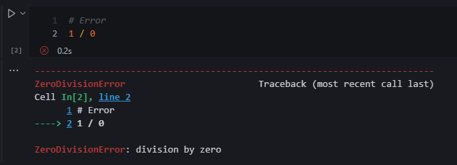

# Chapter 1 

  

## 1.1 Programming (general)  
**Input**:
Receives data  
**Process**:
Performs computations on that data  
**Output**:
Program puts that data somewhere. 

There are a sequence of steps and an order a program must follow. 
!!! info " "
    When reading a book, you open the book a certain way depending on your region and you start to read words from left to right to ingest sentences as you read from top to bottom. You can say there is an order of operations here.  

??? tip "YouTube Video"
    Here is an example where a parent teaches their kids how to write a process in sequential logical steps.  
    Metaphorically, the father can be the computer, the document will be the program.  

    (Ctrl + Click to open in new tab)  
    https://www.youtube.com/watch?v=cDA3_5982h8

--- 

## 1.2 Programming using Python  
**Python Interpreter**:
Program that executes code written in the python programming language.  

??? example "🦖 Example"

    I started my Python Interpreter using windows CMD/PowerShell with below snippet.  
    (Python should start up if PATH variables were setup on installation.)  
    Note - You can't start a "Python Application" just by installing Python, you 
    have to start Python from another software like an **IDE** (1) or from your **CMD** (2).  
    { .annotate }  

    1. **Integrated Development Environment (IDE)**  
    Examples of IDE's are VSCode, Sublime, IDLE, Thonny, Spyder, and Python Interpreter using CMD. 
    2. **Command Prompt** (CMD)  
    Default command-line interpreter for the OS.  
    I strongly suggest learning how to use your command prompt.  
    Watch this to get started! 👉 [YouTube Tutorials](https://www.youtube.com/watch?v=MBBWVgE0ewk&list=PL6gx4Cwl9DGDV6SnbINlVUd0o2xT4JbMu) 

    ```
    python
    print('Hello World!')
    ```  
    
    

**Interactive Interpreter:**
Program that allows to execute one line of code at a time.  

**Code**:
Code is a common word for the textual representation of a program (and hence programming is also called coding).  

**Line**:
Row of text.  

**Prompt**:
">>>", this indicates the interpreter is ready to accept code.  

**Statement**:
A statement is a program instruction.  

**Expressions**:
Expressions are code that return a value when evaluated; for example, the code wage * hours * weeks is an expression that computes a number.  

```
wage = 20
hours = 40
weeks = 52
salary = wage * hours * weeks
print(salary)
```

**Variables**:
The names wage, hours, weeks, and salary are variables, which are named references to values stored by the interpreter.  

**Assignment**:
A new variable is created by performing an assignment using the = symbol.  


??? question "Variables - Why is this is awesome!?"

    Now you can refer to your previous assignments 🤯.  
    1. If you put a paragraph in writing and assign that paragraph to a variable, you don't have to copy and paste that paragraph every single time to refer to it.  
    2. You can change and evolve the variable, refer to an old input to add something new.  
    
    !!! info  " "
        below is **pseudo code** (1), not **Pandas** (2) Syntax.
        { .annotate }

        1. Informal notation of programming language. 
        2. Python Library, think excel + sql for Python.  

    df =  

    | person | age |  
    | ------ | --- |  
    | Harry  | 12  |  

    Lets add one more row to df

    newRow =  

    | person | age |  
    | ------ | --- |  
    | Ron    | 13  | 

    df + newRow = 

    | person | age |  
    | ------ | --- |  
    | Harry  | 12  |  
    | Ron    | 13  | 

    df = df + newRow  

**print()**:
Print() function displays variables or expression values.

**Comments**:
Characters such as "#" denote comments, which are optional but can be used to explain portions of code to a human reader.  

```
# See <-- HashtagComment, subscribe, It means the interpreter will ignore this line of code. Write all the notes within the same line. If you make the person scroll to read, its already too long. Please create another comment line.
storeThisValue = 13
itDoesntMatterWhatYouCallMe = '13'
butItKindOfDoes = ':)'  
```  

!!! abstract "Formatting & Standards"  

    There is a standard way of writing so we all can be in unison to understand each other's code.  
    [PEP 8 Style Guide](https://peps.python.org/pep-0008/#:~:text=The%204%2Dspace%20rule%20is%20optional%20for%20continuation%20lines.&text=(Also%20see%20the%20discussion%20of,or%20after%20binary%20operators%20below.))  

---

## 1.3 Basic input and output  
Python by itself comes with built in functions you can use. 

??? info "metaphor"  

    Similar to excel, you use SUM(), COUNT(), etc to do aggregations. These are built in functions that come with Excel.  

```
print()
```

In python, we utilize print to output data in text or in a string format.  

??? question "Why print()?"

      

    - We can display outputs of lines sequentially to better debug if needed  
    - To display any outputs, when you run code in automation, you don't need to see outputs for everything. Unless you want to be a rebel.  
    - Display warnings, notes, etc.  

### Keeping output on the same line
Notice the "WOW" ending separator.  
end: adds on a string the the end of your print statement  

```
print('This is one line.', end= 'WOW')
print('This is a second line.', end= ' ')
print('This is a third line.')
```

### Moving output to the next line
newline character:
\n  

??? question "What is an Escape Sequence?"

      
    Note the backslash is an escape sequence.  
    An escape sequence is a string that has a special meaning, like the newline character "\n", that always starts with a backslash "\".  
    Other escape sequences exist, such as "\t" to insert a tab, or "\\" to print an actual backslash character.

```
print('This is one line.', end= '\n')
print('This is a second line.', end= ' ')
print('This is a third line.')
```

### Basic input
The input() function:
is used to read input from a user. The statement best_friend = input() will read text entered by the user, and assign the result as a new string to the best_friend variable.  
The input() function causes the program to wait until the user has entered text and pushed the return key.  

```
input('Write something here to show as a notification before a user puts input')

# You don't need to have a string as a parameter like below, notice this is a comment because of #

input()
```

??? example "🦖 Example - input()"

    Have a user input a value and store it as a variable for later use.  
    Ex. Get users body weight, age, sex, and height to calculate BMI.

!!! info "Note"

    Just remember input() receives everything as a string.  
    If you want to store as an integer, you must convert.  

---

## 1.4 Errors  


Syntax Errors:
Violates the programming language rules. Basically Python does not understand what you want to do.  

Runtime Errors:
Syntax is correct, however the operation is impossible to run.  

Crash:
Abrupt termination of a program  

??? example "🦖 Example - Error"

    The error pinpoints to the line where the error occurred and labels the error accordingly.  
    

### Common Error Types

|Error type|Description|  
|-|-| 
|SyntaxError|The program contains invalid code that cannot be understood.|  
|IndentationError|The lines of the program are not properly indented.|  
|ValueError|An invalid value is used, which can occur if giving letters to int().|  
|NameError|The program tries to use a variable that does not exist.|  
|TypeError|An operation uses incorrect types, which can occur if adding an integer to a string.|  

Logic Errors / Bugs:
Errors that run correctly but not behave as intended.  

??? example "🦖 Example - Logic Error"

      
    You fat fingered some numbers on a spreadsheet, therefore your numbers are off.  
    Everything ran correctly, however the output is not as intended.  

---

## 1.5 Development environment  
Integrated Development Environment (IDE)  
Any development of code is usually conducted in an IDE.  

Some Software you can download to code in Python:  

1. [VSCode](https://code.visualstudio.com/)
2. [Sublime Text](https://www.sublimetext.com/)
3. [IDLE, Python Interpreter](https://www.python.org/)
4. [Thonny](https://thonny.org/)
5. [Spyder](https://www.spyder-ide.org/)
6. [Jupyter Notebooks](https://jupyter.org/)  

---  

## 1.6 Computers and programs (general)  
First think of a light switch

- [x] On 🌕 Or True Or 1
- [ ] Off 🌑 or False or 0

The oldest computers were built on large components with the general idea of using switches (on or off) to perform simple calculations.

??? example "🦖 Example"

      
    Imagine people constantly switching a line to connect you to another person via telephone hard line.  
    - The analogy here is when a person switches the connection, they connect you to another hard line. Meaning they turn on the switch manually  

    - [x] I just connected you to another line to communicate to Mr. Columbus.  
    - [ ] I just removed the connection to the line communicating with me, your friendly operator.

Bits: 
Binary digits consisting of 1 and 0s  

Fast Track to a point where that room with the operator is scaled down to a tiny processor.  
  

- There many, many, and many switches occurring in the backend here.  
- Modern processors contain billions of transistors, these transistors could be thought as switches.  

These processors take in instructions or a list of desired calculations.  
**Instruction**:
Desired calculation  

*Example of types of instructions that a processor might use.*  

|Output|Result|  
|--|--|  
|Add X, #num, Y	|Adds data in memory location X to the number num, storing result in location Y|  
|Sub X, #num, Y	|Subtracts num from data in location X, storing result in location Y|  
|Mul X, #num, Y	|Multiplies data in location X by num, storing result in location Y|  
|Div X, #num, Y	|Divides data in location X by num, storing result in location Y|  
|Jmp Z	|Tells the processor that the next instruction to execute is in memory location Z|  


**Memory**:
A Circuit that stores 0s and 1s in each of a series of thousands.  
  

The processor interacts with memory or list of desired instructions.  

??? example "Analogy" 

    Like when you store macros in excel to reuse again later.
    The macro are instructions stored in memory that can be accessed at a later time.  

**Machine Instructions:**
Instructions represented by 0s and 1s.  

**Executable Program:**
Sequence of instructions.  

**Assembly**:
Programs to translate machine instructions to a friendly readable hooman format.  

!!! info "📖"  
    
    Back then, programmers coded in 0s and 1s 🥲. They soon realized this was a nightmare and created assemblers to translate
    the machine instructions.  

**High-level Languages:**
Language that supported programming using formulas and algorithms.  

- FORTRAN ("Formula Translator") is one of these languages.  
- This formula was able to be understood thanks to High-level languages,  F = (9 / 5) * C + 32 

**Compilers:**
Programs to further support high level languages that automatically translate High-Level Languages to executable programs.  

- Basically translate hooman code back to machine instructions in order to execute.  

*High-Level Language*  
```
put "Enter wage: "
hourlyWage = Get next input
put "Salary is: "
put (hourlyWage * 40 * 52)

```  

*Executable Program*  
```
011 1100001 001001 1100010
100 1100010 000101 1100010
011 1100010 100000 1100011
011 1100001 001001 1100010
```

---  

## 1.7 Computer tour  
**I/O (Input / Output):**
Keyboards, headphones, monitor, peripheral, motherboard, etc.  


**Storage:**
Hard Drives (HD), Solid State Drives (SSD) that store data. These storage devices are non-volatile, which means they maintain their content even when powered off. 

!!! quote "How Memory is Maintained?"  

    Zybooks  
    They do so by orienting magnetic particles in a 0 or 1 position. The disk spins under a head that pulses electricity at just the right times to orient specific particles (you can sometimes hear the disk spin and the head clicking as the head moves). New flash storage devices store 0s and 1s in a non-volatile memory rather than disk, by tunneling electrons into special circuits on the memory's chip, and removing them with a "flash" of electricity that draws the electrons back out.

**Memory (RAM):**
Random Access Memory (RAM) temporarily holds data from storage and designed for faster access. RAM is volatile, meaning when the computer shuts off, the memory is wiped.  

-  Memory size is typically listed in bits/bytes where a byte is 8 bits.

  

!!! quote "Random Access"  

    Zybooks  
    The "random access" term comes from accessing any memory location quickly and in arbitrary order, without spinning a disk to get a proper location under a head.  

**Processor:**
Runs computer programs which reads and executes instructions from memory. Can perform operations of reading and writing data from and into memory.  

- Can have its own "RAM" memory built in called **cache memory**.

!!! quote "What happens within a processor?"  

    Zybooks  
    When powered on, the processor starts executing the program. The first instruction is typically at memory location 0. That program is commonly called the BIOS (basic input/output system), which sets up the computer's basic peripherals. The processor executes a program called an operating system (OS). The operating system allows a user to run other programs and interfaces with the many other peripherals. Processors are also called CPUs (central processing unit) or microprocessors (a term introduced when processors began fitting on a single chip, the "micro" suggesting its small size). Because speed is so important, a processor may contain a small amount of RAM on its own chip, called cache memory, accessible in one clock tick rather than several, for maintaining a copy of the most-used instructions/data.

**Clock:**
A processor executes instructions at a rate governed by the processor's clock/frequency. 

- They have clocks ranging from 3 GHz to say 5 GHz. (1 GHz is 1 billion ticks/second)  

Computers can run multiple instructions/programs simultaneously.

**Integrated Circuit (IC):**
Many transistors/switches on a single chip.  

**Moore's Law:**
Doubling the capacity of IC roughly every 18 months. (The number of switches/transistors increases doubles within the same size)

- This is lately decreased (not doubling), however still making improvements.  

---  

## 1.8 Language history  
Guido van Rossum:
The person who created Python in the late 1980s  

- Python was derived from an existing language ABC  
- Python came from the TV Show Monty Python's Flying Circus, which Guido liked.  
- The goal for the language is simplicity and readability.
- Python is an **open-source**(1)  
    { .annotate }  

    1. The community (even you) can participate in defining the language and creating new interpreters.  

## 1.9 Why whitespace matters  

??? question "What is whitespace?"  

    Any blank space or newline.
    ```
      ⬅️ White space (3 spaces)
        ⬅️ a Tab, also white space
    
    ⬆️ Above blank line is white space.  
    ```   

Programming requires precision and attention to detail.

??? example "🦖 Example"  

    - = and == have different meanings
    - =! and != only one of these is recognized

The general idea is, get the foundational knowledge in syntax and spacing correct to avoid future grueling headaches.  

??? question "Do you struggle with attention to details at times?"  

    YES! We all do and its okay. We do not have to be a perfectionist when we start typing.  
    There are best practices we can go through to ensure we have working code.  

    1. Run small bits of code to test the outputs
        - Testing is best and easier through Jupyter Notebooks. 

    2. In development, use many print statements to show your output.  
        - As you get better, you will use less print statements.
    
    As you gain experience, your attention to detail will become better.  
      

---  

## 1.10 Python example: Salary after taxes calculation 🫡
  

Lets get a rough estimate of our net income after taxes. How much are you actually taking home?

Lets assume you are filing "Single", live in California, and earn $80,000 base salary.  

??? info "State and Federal Income Brackets"

    Links below for reference of where we got the screenshots.  
    [Federal Tax Bracket](https://www.irs.gov/pub/irs-pdf/p17.pdf)  
    [State Tax Bracket](https://www.ftb.ca.gov/forms/2023/2023-540-tax-rate-schedules.pdf)  
    Lets assume you are filing as single for this example.  
      
    ")  

```
SALARY = 80000
californiaTax = 3009.40 + (SALARY - 68350) * .093
stateTax = 5147 + (SALARY - 44725) * .22
salaryAfterTax = SALARY - californiaTax - stateTax

print('This is my Net Income after taxes 😓')
print(salaryAfterTax)
print("Uncle Sam's cut")
print((californiaTax + stateTax) / SALARY * 100)
print('Which means I take home below every month, I still need to remove any insurance and benefit fees')
print(salaryAfterTax / 52 * 4)
```