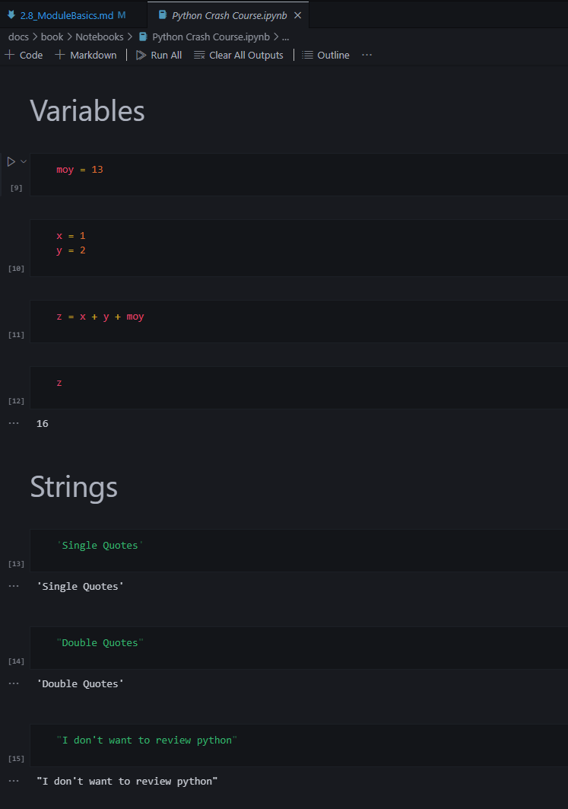

# 2.8 Module Basics  
## Different Formats to Save Python Files  
### .py extension
When you save a python file as 'SomeSmartName.py', you create a simple python file that is similar to a txt file.  
In this file, you will see many lines of code, all of which creates a script.  

??? example ".py example"

    Notice it the same as a text file, with the difference of having python syntax within and a different extention.
    

??? question "How do you run the script"  

     

    ### CLI Way  
    For .py extensions, you can use your CLI to execute the script. You open you cli and type in the file name and path to execute.  

    - If you are in the same folder of your .py file, then use below command.  
    `python SomeSmartName.py`    

    ### GUI Way
    Assuming you are using VS Code, you can hit the play button at the top right.  

    ??? example "Play Button"

        

### .ipynb (Interactive Python Notebook)
We will be working with .ipynb closely due to its modular architecture. Unlike .py files, with Jupyter Notebook style, we have blocks of cells that can be individually executed.  

??? example ".ipynb example"

    

- You cannot run .ipynb from CLI with python's built in capabilities. You would need to import libraries to do so.
- You run Jupyter style notebooks from the IDE normally.
- Having blocks of cells allows you to have more flexibility to develop and test your code.
- Better visualization outputs
- Friendlier to work with and easier for the eyes.

### Use Case Scenario
When to use .py or .ipynb for production environments? (Work settings)  
**It depends on the use case.**  

### When you have a on-premise server
Meaning your company owns the computers and servers and are physically on site. 
- If you plan to run your scripts on a schedule utilizing the server, then saving .py files on the server would be beneficial.
- This way, windows server can execute that python.py file on a frequency.

### When you want to upload your script to cloud
- What if you want to execute a TransformData.py every hour. You would upload your .py file onto the cloud and use the cloud's software to set up the execution frequency.

### When you work with Databricks, or Azure Notebooks, or another cloud technology that utilizes notebooks
If this is the case, you mostly work with .ipynb

- This is because these SAAS applications with notebook features can schedule workflows to run all of your notebook cells.
- This environment is common for data analyst, data engineers, and data scientists.

!!! tip "To Summarize"  

    Realistically you might end up working with both with an emphasis on another format.  
    So get to know both!  

---

## Module Stuff
  

**Script:**
Programmers typically write Python program code in a file called a script.  

**Module:**
A module is a file containing Python code that can be used by other modules or scripts.  

??? info "import Module"

    Basically you create a function within a .py file. You can now import this Module/function into another script to reuse it.  

**Import:**
A module is made available for use via the import statement.  

- Python's built in function, this is how you use more libraries once downloaded.
- Analogy, this is how you can reuse functions and classes you create or use other people's functions and classes created.

**Dot Notation**
Once a module is imported, any object defined in that module can be accessed using dot notation.  

??? example "Dot example"

    Assuming you have created a MyFirstFunction.py file with a function called bmi_calculator.  
    On a new notebook or .py
    
    1. `import MyFirstFunction`  
    2. `MyFirstFunction.bmi_calculator'

    Using the . allows you to bring any function or class in from that module or .py file.

**\__name__:**
Python programs often use the built-in special name \__name__ to determine if the file was executed as a script by the programmer or imported by another module.  

??? question "Why use \__name__"  
    
    When we import a module or .py file, we essentially run all of the script unless we explicitly put below.  

    ```
    # Is this the main file we are running or is it essentially an import?
    if __name__ == '__main__':
        # If this is the main file, lets run the meat and potatoes of this script
        main()
    else:
        # If this is not the main file, lets just run below function OR do nothing at all (to import functions)
        some_other_function()
    ```

    Sometimes we don't want to run everything within the module, just want to grab a few functions. This is when /__name__ really helps.  