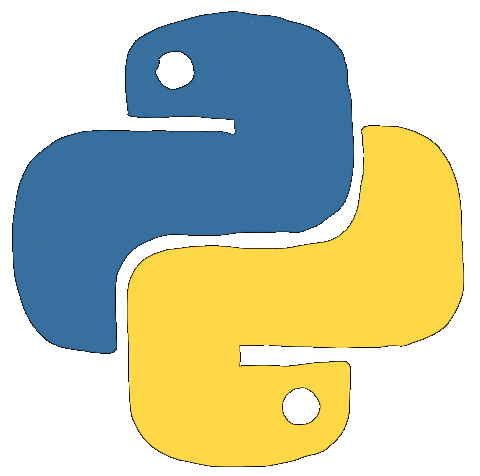

# Welcome to IS 640 Business Application Programming!
  

## Class  
Class IS 640 Section 2, Programming for Business Analytics Fall 2024.

## Course Description

This course delves into Python programming and its application in business data analysis. Students will design, analyze, and implement business applications that leverage advanced programming tools and techniques. The curriculum focuses on developing business applications of varying complexity, emphasizing efficient ETL (Extract, Transform, Load) data processing methods. By the end of the course, students will build a programming mindset and master best practices in business application development.  

## Book
??? abstract "Book Details"
    IS 640: Business Application Programming  
    Zybook Code: 
    **CSULBIS640PatelFall2025**  

## Lectures
Lectures are a combination of Zybooks IS 640: Business Application Programming and my notes.

- [Chapter 1](notes/ch01/index.md) — getting our hands on Python  
- [Chapter 2](notes/ch02/index.md) — variables, types and expressions  
- [Chapter 3](notes/ch03/index.md) — strings, lists, tuples and dictionaries  

New here? Start with [how to use this site](course/how-to-use-this-site.md) — search and the chapter hubs will save you a lot of scrolling.  