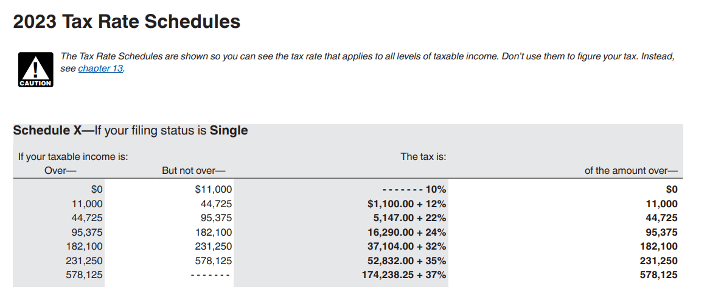

# 1.10 Python example: Salary after taxes calculation  
  

Lets get a rough estimate of our net income after taxes. How much are you actually taking home?

Lets assume you are filing "Single", live in California, and earn $80,000 base [salary](1.2-programming-using-python.md).  

??? info "State and Federal Income Brackets"

    Links below for reference of where we got the screenshots.  
    [Federal Tax Bracket](https://www.irs.gov/pub/irs-pdf/p17.pdf)  
    [State Tax Bracket](https://www.ftb.ca.gov/forms/2023/2023-540-tax-rate-schedules.pdf)  
    Lets assume you are filing as single for this example.  
      
    ")  

```
SALARY = 80000
CaliforniaTax = 3009.40 + (SALARY - 68350) * .093
StateTax = 5147 + (SALARY - 44725) * .22
SalaryAfterTax = SALARY - CaliforniaTax - StateTax

print('This is my Net Income after taxes 😓')
print(SalaryAfterTax)
print("Uncle Sam's cut")
print((CaliforniaTax + StateTax) / SALARY * 100)
print('Which means I take home below every month, I still need to remove any insurance and benefit fees')
print(SalaryAfterTax / 52 * 4)
```

## See also

- [1.2 Programming using Python](1.2-programming-using-python.md)  
- [Arithmetic Expressions](../ch02/2.5-arithmetic-expressions.md)  
- [Numeric Types](../ch02/2.4-numeric-types.md)  
