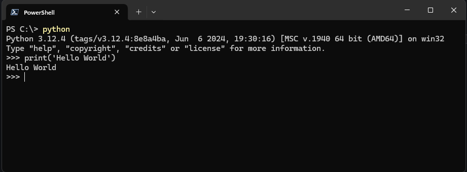

# 1.2 Programming using Python  
**Python Interpreter**:
Program that executes code written in the python programming language.  

??? example "🦖 Example"

    I started my Python Interpreter using windows CMD/PowerShell with below snippet.  
    (Python should start up if PATH variables were setup on installation.)  
    Note - You can't start a "Python Application" just by installing Python, you 
    have to start Python from another software like an [**IDE**](1.5-development-environment.md) (1) or from your **CMD** (2).  
    { .annotate }  

    1. **Integrated Development Environment (IDE)**  
    Examples of IDE's are VSCode, Sublime, IDLE, Thonny, Spyder, and Python Interpreter using CMD. 
    2. **Command Prompt** (CMD)  
    Default command-line interpreter for the OS.  
    I strongly suggest learning how to use your command prompt.  
    Watch this to get started! 👉 [YouTube Tutorials](https://www.youtube.com/watch?v=MBBWVgE0ewk&list=PL6gx4Cwl9DGDV6SnbINlVUd0o2xT4JbMu) 

    ```
    python
    print('Hello World!')
    ```  
    
    

**Interactive Interpreter:**
Program that allows to execute one line of code at a time.  

**Code**:
Code is a common word for the textual representation of a program (and hence programming is also called coding).  

**Line**:
Row of text.  

**Prompt**:
">>>", this indicates the interpreter is ready to accept code.  

**Statement**:
A statement is a program instruction.  

**Expressions**:
Expressions are code that return a value when evaluated; for example, the code wage * hours * weeks is an expression that computes a number.  

```
wage = 20
hours = 40
weeks = 52
salary = wage * hours * weeks
print(salary)
```

**Variables**:
The names wage, hours, weeks, and salary are [variables](../ch02/2.1-variable-assignments.md), which are named references to values stored by the interpreter.  

**Assignment**:
A new variable is created by performing an assignment using the = symbol.  


??? question "Variables - Why is this is awesome!?"

    Now you can refer to your previous assignments 🤯.  
    1. If you put a paragraph in writing and assign that paragraph to a variable, you don't have to copy and paste that paragraph every single time to refer to it.  
    2. You can change and evolve the variable, refer to an old input to add something new.  
    
    !!! info  " "
        below is **pseudo code** (1), not **Pandas** (2) Syntax.
        { .annotate }

        1. Informal notation of programming language. 
        2. Python Library, think excel + sql for Python.  

    df =  

    | person | age |  
    | ------ | --- |  
    | Harry  | 12  |  

    Lets add one more row to df

    newRow =  

    | person | age |  
    | ------ | --- |  
    | Ron    | 13  | 

    df + newRow = 

    | person | age |  
    | ------ | --- |  
    | Harry  | 12  |  
    | Ron    | 13  | 

    df = df + newRow  

[**print()**](1.3-basic-input-and-output.md):
Print() function displays variables or expression values.

**Comments**:
Characters such as "#" denote comments, which are optional but can be used to explain portions of code to a human reader.  

```
# See <-- HashtagComment, subscribe, It means the interpreter will ignore this line of code. Write all the notes within the same line. If you make the person scroll to read, its already too long. Please create another comment line.
storeThisValue = 13
itDoesntMatterWhatYouCallMe = '13'
butItKindOfDoes = ':)'  
```  

!!! abstract "Formatting & Standards"  

    There is a standard way of writing so we all can be in unison to understand each other's code.  
    [PEP 8 Style Guide](https://peps.python.org/pep-0008/#:~:text=The%204%2Dspace%20rule%20is%20optional%20for%20continuation%20lines.&text=(Also%20see%20the%20discussion%20of,or%20after%20binary%20operators%20below.))  

## See also

- [1.3 Basic input and output](1.3-basic-input-and-output.md)  
- [1.5 Development environment](1.5-development-environment.md)  
- [Variables and assignments](../ch02/2.1-variable-assignments.md)  
