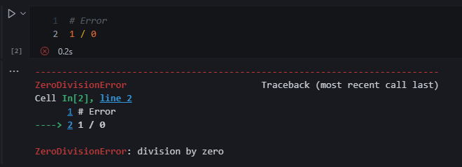

# 1.4 Errors  

Syntax Errors:
Violates the programming language rules. Basically Python does not understand what you want to do.  

Runtime Errors:
Syntax is correct, however the operation is impossible to run.  

Crash:
Abrupt termination of a program  

??? example "🦖 Example - Error"

    The error pinpoints to the line where the error occurred and labels the error accordingly.  
    

## Common Error Types

|Error type|Description|  
|-|-| 
|SyntaxError|The program contains invalid code that cannot be understood.|  
|IndentationError|The lines of the program are not properly indented.|  
|ValueError|An invalid value is used, which can occur if giving letters to int().|  
|NameError|The program tries to use a variable that does not exist.|  
|TypeError|An operation uses incorrect types, which can occur if adding an integer to a string.|  

Logic Errors / Bugs:
Errors that run correctly but not behave as intended.  

??? example "🦖 Example - Logic Error"

      
    You fat fingered some numbers on a spreadsheet, therefore your numbers are off.  
    Everything ran correctly, however the output is not as intended.
